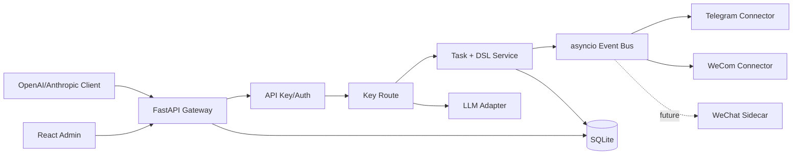
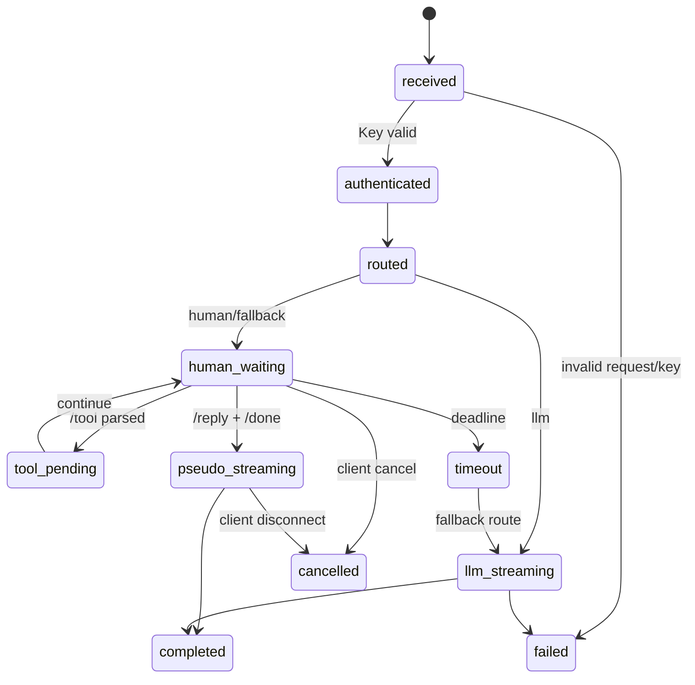

# Human LLM Gateway 架构设计

> V1 状态：架构已确认，进入实现阶段。

## 1. 目标与非目标

### 目标

- 对外兼容 OpenAI Chat Completions、Anthropic Messages，以及 JSON/SSE。
- 请求可路由到人工 IM、真实 LLM，或人工超时后的真实 LLM。
- 真人在 IM 中发送一段 DSL 文本，由系统解析为 reasoning、tool_call、final 事件并模拟流式输出。
- 后台配置 API Key、真人、IM 连接、LLM 供应商、模型路由、超时和伪流式策略。
- 管理员可在任务详情页直接发送人工回复；网页回复与 IM 回复共用同一个 DSL、状态机和幂等规则。
- 支持多组 `API Key + 真人 + IM 账号/连接`，每组相互隔离。

### 非目标

- V1 不引入 PostgreSQL、Redis、分布式队列或多节点高可用。
- V1 不宣称个人微信已实现；个人微信只保留 Windows Sidecar 契约。
- 不复制 cc-connect、OpenClaw、Koishi、NoneBot、Wechaty 或 AstrBot 的业务代码。
- reasoning 是人工提供的展示轨迹，不声称是模型内部思维。

## 2. 技术栈与部署

- 核心：Python 3.12、FastAPI、Pydantic v2、SQLAlchemy 2、SQLite、asyncio。
- 管理台：React、TypeScript、Vite；生产环境由核心服务提供静态文件。
- IM：统一 Connector 接口；Telegram 使用 Python SDK，企业微信使用官方 Python SDK/协议；个人微信未来通过独立 Sidecar。
- 真实 LLM：统一 `LLMAdapter`；供应商配置保存于数据库，支持 OpenAI-compatible Chat Completions 和 Anthropic Messages。模型目录由管理员显式同步上游 `/models` 获取，不在核心中写死版本号。



V1 是单 Python 进程：API、任务调度、Connector Manager 和 LLM Adapter 在同一进程；连接器可在 V2 拆为独立进程，不改变核心契约。

## 3. 分层边界

1. **协议层**：解析 OpenAI/Anthropic 请求，生成 JSON/SSE；不得包含 IM SDK 逻辑。
2. **鉴权与路由层**：校验 Key，读取唯一绑定关系，决定 human/llm/fallback。
3. **任务层**：创建任务、关联会话、状态迁移、超时、取消、幂等。
4. **人工 DSL 层**：把完整 IM 文本解析为有序事件，并验证命令和 JSON 参数。
5. **渲染层**：将事件按 chunk 策略和随机延迟变为协议事件；测试可禁用睡眠并注入固定随机源。
6. **连接器层**：只负责平台收发、连接状态和平台消息归一化。
7. **配置/持久化层**：SQLAlchemy Repository；所有环境值从 Settings 读取。
8. **网页人工台**：管理员任务列表/详情和回复入口，回复源标记为 `web`，按任务所属 Key 校验权限。

## 4. 绑定规则与实体

核心约束：

- `ApiKey 1:1 HumanOperator`。
- `ApiKey 1:1 ImConnection`。
- 可存在很多 ApiKey、真人和 IM 连接；不同 Key 的任务、会话、状态互不可见。
- 同一个 Key 不进入多人抢答池；收到非绑定真人消息必须拒绝或忽略并审计。
- V1 默认一个 IM 连接实例只服务一个 Key，避免多个 Key 在同一聊天窗口串线；未来可显式支持共享连接。
- `LLMProvider 1:N ModelRoute`；模型供应商可被多个路由引用，Key 只引用路由。路由同时保存对外模型名和后台指定的 `upstream_model`；客户端请求体里的 `model` 永远不参与上游选择。

主要表：`api_keys`、`human_operators`、`im_connections`、`llm_providers`、`model_routes`、`requests`、`request_events`、`conversations`、`system_settings`、`audit_logs`。

## 5. 请求状态机



终态为 `completed`、`timeout`、`cancelled`、`failed`。状态迁移必须带版本号，重复 IM 消息使用 `external_message_id` 幂等。

## 6. 人工 DSL

```text
/think
先判断问题，再调用天气工具。
/tool get_weather {"city":"北京","unit":"c"}
/reply
北京今天晴，最高 25°C。
/done
```

- `/think` 和 `/reply` 支持多行，内容直到下一个命令。
- `/tool <name> <JSON>` 产生模拟 `tool_call`，V1 不执行真实工具。
- `/done` 结束解析并开始伪流式；缺失 `/done` 继续等待或超时。
- 无命令纯文本可按配置作为快捷 `/reply`。
- 命令错误、JSON 错误、顺序错误要向人工回执，并保留失败审计。

网页回复使用 `POST /admin/tasks/{task_id}/reply`，请求体为完整 DSL 文本；它不绕过
Connector，也不创建新的 Key，服务端会写入同样的 `RequestEvent`，并将 `source=web`。

## 7. Connector 契约

进程内接口：

```python
class Connector(Protocol):
    async def start(self, config: Mapping[str, Any]) -> None: ...
    async def stop(self) -> None: ...
    async def status(self) -> ConnectorStatus: ...
    async def health(self) -> HealthResult: ...
    async def send_task(self, task: OutboundTask) -> DeliveryResult: ...
    async def handle_inbound(self, message: InboundMessage) -> None: ...
```

`InboundMessage` 至少含 `connector_id`、`account_id`、`sender_id`、`conversation_id`、`external_message_id`、`text`、`received_at`。核心通过 `connector_id + sender_id` 校验 Key 绑定。

## 8. 未来 Sidecar 契约

- 上行：`POST /internal/connectors/{id}/events`，事件带 `event_id`、签名、时间戳、连接器 ID。
- 下行：`GET/WS /internal/connectors/{id}/commands`，命令包含 `task_id`、目标会话、文本和幂等 ID。
- Sidecar 只拿到自身连接配置，不拿 API Key 或其它连接器的密钥。
- 传输失败采用幂等重试；核心以数据库状态为准，不以网络响应直接判定人工已回复。

## 9. 安全与配置

- API Key 创建时明文只展示一次，数据库只存 hash 和 prefix。
- IM/LLM 密钥使用主密钥加密或安全引用；日志、错误和后台列表全部脱敏。
- 管理后台首期单管理员；密码使用强哈希，登录限速，配置修改写审计。
- 请求、人工内容和 reasoning 的留存策略可配置；默认不记录完整密钥。
- 所有超时、延迟、chunk 大小、端口和 URL 使用 Settings/数据库配置，不散落硬编码。

## 10. 关键取舍与演进

- 先用 SQLite + asyncio 降低部署复杂度；Repository 和事件接口为 V2 PostgreSQL/Redis 保留边界。
- 业务核心自研；Python/TypeScript 技术栈匹配的 SDK 可依赖，Go/Node 网关仅作为 Sidecar 或参考。
- V2 可加入独立 Worker、Redis Stream、多租户、共享 IM 连接、更多平台、真实 tool 执行和任务恢复。

## 11. 模型目录与管理员权威路由

- `GET /v1/models` 只返回当前 API Key 所属路由发布的对外模型名。
- 客户端可以传入任意兼容 SDK 要求的 `model` 字符串；网关不按它切换模型，实际请求始终使用路由的 `upstream_model`。
- 管理员可调用 `POST /admin/providers/{id}/models/sync`，显式从已配置供应商的 `/models` 拉取目录并保存；未配置凭据或网络不可用时不会自动探测，也不会在启动时发出请求。
- 供应商支持 `openai_compatible` 和 `anthropic` 协议；因此 OpenAI、Claude、Kimi、MiniMax、DeepSeek、Qwen 等只要提供相应兼容 API 地址和凭据，即可通过后台配置，不依赖写死模型版本。
