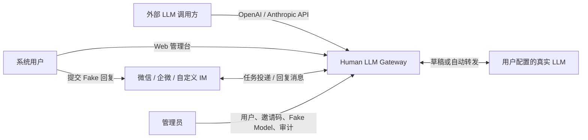
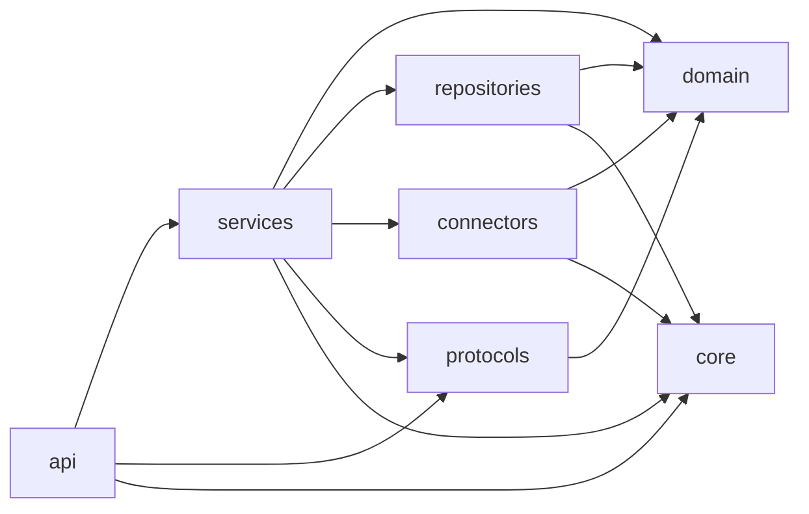
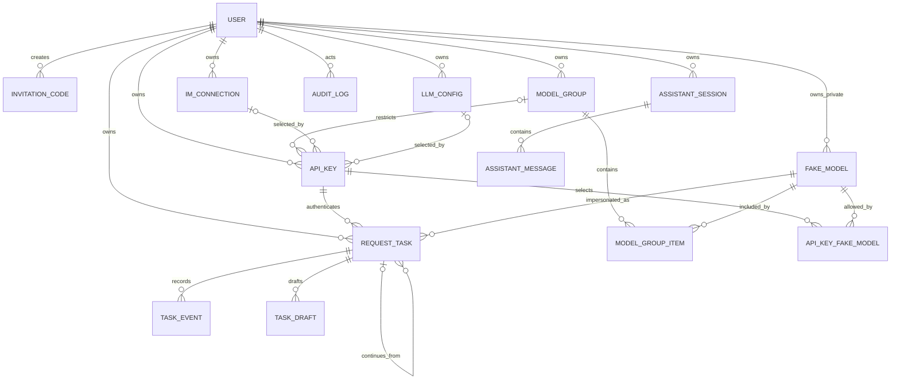
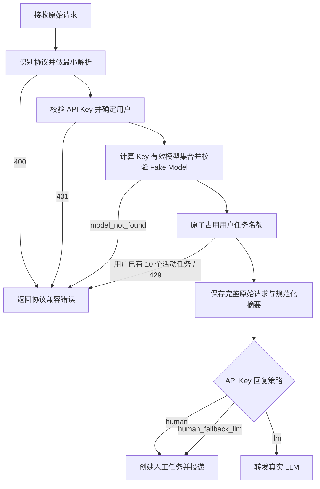
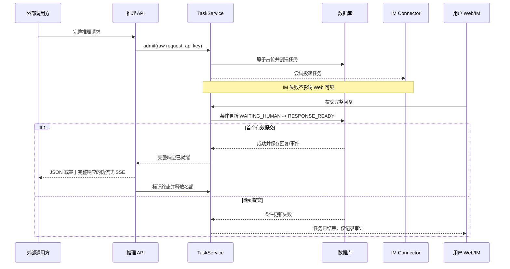
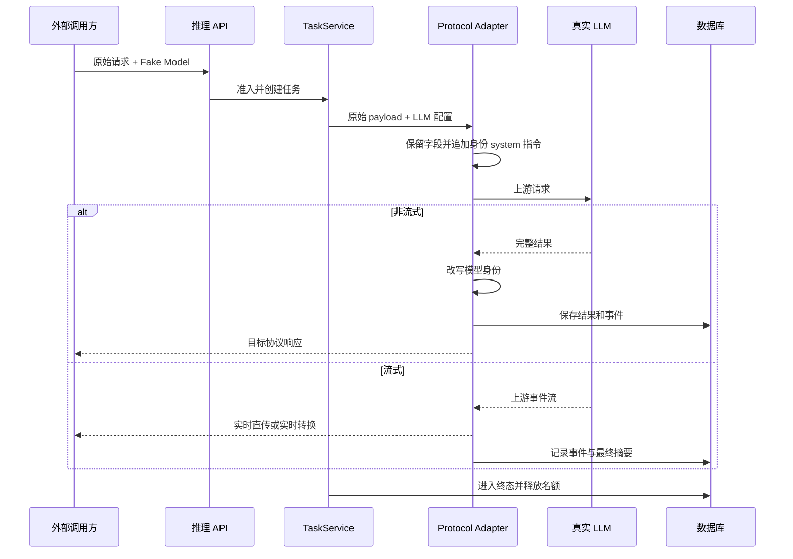
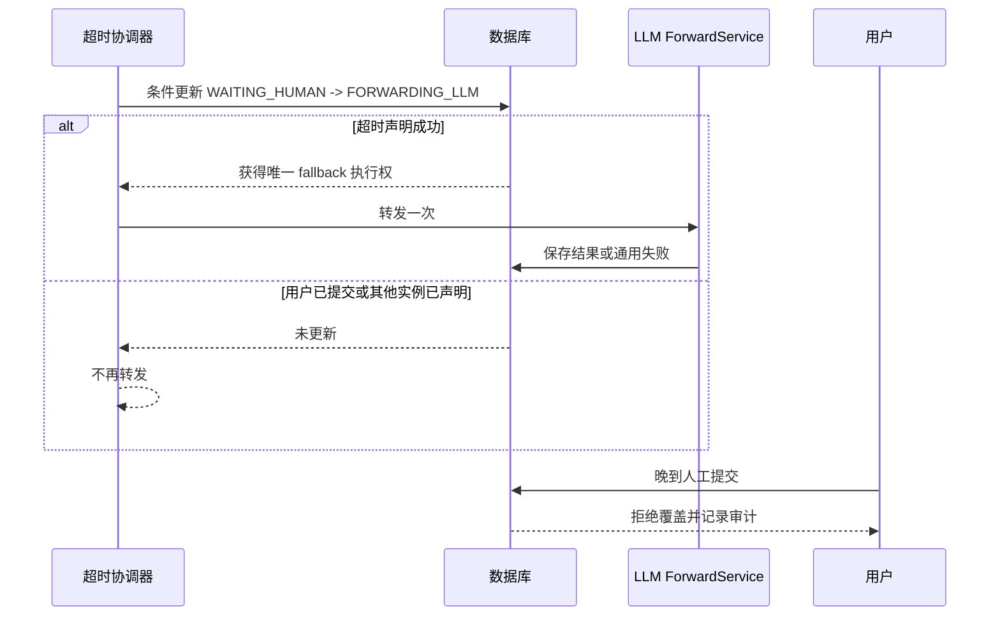
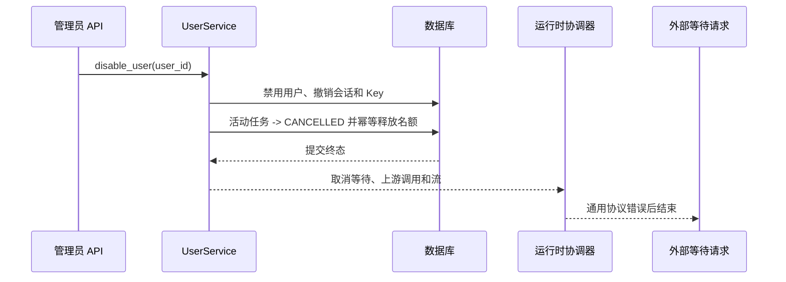
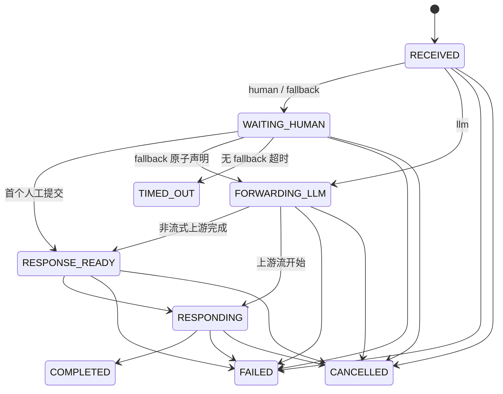
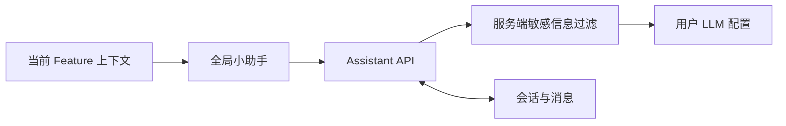

# Human LLM Gateway 目标架构

> 文档状态：M1 目标架构基线
>
> 当前代码处于过渡期；M2 必须在一个完整提交中一次性切换到本文件定义的领域模型和模块边界，不允许新旧表、新旧运行链路或兼容代理共存。

## 1. 架构原则

1. **Fake Model 与真实 LLM 解耦**：Fake Model 是对外身份，LLM 配置是用户私有上游连接。
2. **API Key 是请求归属入口**：鉴权后立即确定用户、回复策略、投递入口和可选 LLM 配置。
3. **先准入、再创建任务**：模型权限和用户级 10 任务上限必须在投递或转发前完成。
4. **原始请求优先**：完整保存调用方 payload；规范化视图仅用于业务判断和协议转换。
5. **协议适配与业务编排分离**：协议层负责解析和输出，服务层负责任务生命周期。
6. **连接器可插拔**：IM 平台通过注册表和统一接口接入，核心服务不按平台写条件分支。
7. **敏感数据默认不可见**：Secret 加密、凭据只存哈希、日志脱敏、管理员也不能回读用户 Secret。
8. **数据库承担并发裁决**：邀请码消费、并发名额和首个回复都通过条件更新原子完成。
9. **无历史兼容层**：目标结构直接创建，不维护旧表、旧字段、旧路由或旧连接器别名。
10. **M2 原子切换**：M2-A/B/C 只是同一里程碑的进度工作包，不是可独立提交的新旧共存阶段；目标 Schema、服务、API、前端和测试必须一起切换。

## 2. 系统上下文



系统只有一个部署单元，但内部按职责分层。FastAPI 同时托管管理 API、推理 API、连接器入口和前端静态资源；运行中的长连接由连接器运行时管理，持久状态以数据库为准。

## 3. 目标模块边界

```text
app/
├── api/             # FastAPI 路由、鉴权依赖、请求/响应 Schema
├── domain/          # 实体、值对象、枚举、状态机和领域错误
├── services/        # 用例编排、事务边界和跨模块协调
├── repositories/    # SQLAlchemy 模型、持久化实现和原子条件更新
├── connectors/      # IM 平台适配器、注册表和运行时管理
├── protocols/       # OpenAI/Anthropic 解析、转换、SSE 和错误映射
├── core/            # 配置、加密、日志、request ID 和应用生命周期
└── main.py          # 应用装配，不承载业务规则
```

允许的依赖方向：



约束：

- Router 只做边界校验、鉴权、调用用例和返回映射。
- Service 不直接拼 SQL，不依赖 FastAPI Request/Response。
- Repository 不做跨资源业务编排。
- Domain 不依赖 FastAPI、SQLAlchemy、连接器 SDK 或前端类型。
- Connector 不直接决定任务归属或完成任务，只收发统一命令和事件。
- Protocol Adapter 不查询数据库，也不选择回复策略。

## 4. 核心领域关系



`ModelRoute` 不在目标关系中。API Key 直接保存投递入口、回复策略、LLM 配置、人工超时、可选模型分组和可选模型白名单；Fake Model 只由请求的 `model` 和有效模型集合决定。

系统 Fake Model 的 `owner_user_id` 为空且由管理员维护；用户私有 Fake Model 归所有者使用。Key 的有效模型集合按以下顺序只收窄、不扩张：

1. 当前用户可见且启用的系统模型与私有模型；
2. 若 Key 绑定模型分组，与组内模型取交集；
3. 若 Key 显式选择模型，再与所选模型取交集；未选择代表保留上一步全部候选模型。

## 5. 请求生命周期

### 5.1 统一准入管线



准入失败不得创建任务，也不得调用 IM 或真实 LLM。占位成功但后续持久化失败时，必须在同一事务中回滚，不能遗留名额。

### 5.2 人工响应序列



### 5.3 真实 LLM 直接转发



### 5.4 人工超时降级



### 5.5 禁用用户



数据库终态是事实来源。进程通知失败时由恢复任务补发取消，但不能重复释放名额或把任务恢复为活动态。

## 6. 任务状态机

目标状态：

| 状态 | 含义 | 占用活动名额 |
| --- | --- | --- |
| `RECEIVED` | 已通过初步校验，正在事务内创建。 | 是 |
| `WAITING_HUMAN` | 等待 Web 或 IM 人工提交。 | 是 |
| `FORWARDING_LLM` | 正在请求真实 LLM。 | 是 |
| `RESPONSE_READY` | 完整结果已持久化，等待开始对外响应。 | 是 |
| `RESPONDING` | 正在输出非流式结果、伪流式或上游实时流。 | 是 |
| `COMPLETED` | 响应正常结束。 | 否 |
| `FAILED` | 内部或上游失败，已生成对外通用错误。 | 否 |
| `TIMED_OUT` | 人工超时且没有可用 fallback。 | 否 |
| `CANCELLED` | 请求被明确取消、用户被禁用或服务关闭时安全终止。 | 否 |



只有终态释放用户活动名额。状态推进、`slot_released_at` 标记和用户计数扣减必须在同一事务内幂等完成。

## 7. 协议架构

### 7.1 支持的边界

- OpenAI Chat Completions：`POST /v1/chat/completions`
- OpenAI Responses：`POST /v1/responses`
- Anthropic Messages：`POST /v1/messages`
- OpenAI 风格模型目录：`GET /v1/models`

协议层为每种请求生成两个表示：

1. `raw_payload`：调用方原始 JSON，完整落库并用于同协议保真转发。
2. `normalized_request`：模型、消息文本、tools、stream 等标准语义，用于展示、人工编辑和跨协议转换。

人工回复使用第三个统一表示 `normalized_reply`，包含 reasoning、tool calls 和 final text。Web 编辑器直接读写该结构；IM DSL 只负责把文本解析为同一结构；三个协议渲染器只从该结构生成 JSON/SSE。提交成功后结构不可撤销或覆盖。

未知字段保留在原始表示中。同协议默认原样透传；`previous_response_id` 等声明为网关控制的字段由服务层验证并等价展开。跨协议严格执行字段转换矩阵，无法等价表达的供应商专有字段返回 400，不能静默删除。

### 7.2 响应输出

- 人工或手动编辑结果：先持久化完整回复，再生成目标 JSON 或伪流式 SSE。
- 真实 LLM 同协议流式：尽量逐事件透传，仅改写模型身份和必要字段。
- 真实 LLM 跨协议流式：边接收边转换成目标协议事件。
- tool call 只是响应数据；协议层不触发工具执行。
- 所有响应、事件和最终摘要使用请求中的 Fake Model。
- OpenAI Responses 的 `previous_response_id` 只能引用同一 API Key 的历史响应；网关把历史请求和回复展开为本次上下文，并保留原始引用和关联链。

### 7.3 错误适配

领域错误使用稳定错误码，例如 `invalid_request`、`invalid_api_key`、`model_not_found`、`rate_limit_exceeded`、`upstream_error`。协议层把它们映射为 OpenAI 或 Anthropic 兼容的 HTTP 状态和 JSON/SSE 错误，不把内部异常文本直接返回。

## 8. IM 连接器架构

每个平台实现统一能力接口：

```text
validate_config(config)
start(connection_context)
stop()
health()
deliver(task_envelope)
handle_inbound(platform_message)
```

注册表声明平台元数据、配置 Schema、能力和工厂。连接管理器只按注册表创建实例，不出现 `if platform == ...` 的业务分支。

目标平台：

- 微信 iLink：扫码登录、长轮询/监听、发送消息。
- 企业微信智能机器人：`wecom-aibot-sdk` WebSocket。
- 自定义 Webhook：服务端接收入站，按配置发送出站。
- 自定义 WebSocket：带连接 Token 的双向会话。
- 自定义 HTTP：cursor 拉取任务、提交回复和可选 ACK。

进站处理统一执行：连接鉴权、绑定身份校验、`connection_id + external_message_id` 幂等、任务定位、回复解析、首个回复条件提交。Connector 不绕过 TaskService 直接更新任务。

运行时状态和数据库状态分离：实例是否在线是瞬时状态，最后认证结果、错误摘要、启动意图、重试次数、下次重试时间和健康时间写入数据库。期望运行的长连接遇到普通网络故障时使用带抖动的指数退避自动重连；进入 `auth_required` 后停止重试并等待所有者重新登录。单连接启动、停止、重新应用配置或故障恢复不得影响其他连接。

## 9. LLM 转发架构

`LLMForwardService` 接收任务、用户 LLM 配置和目标协议，职责包括：

1. 解密当前用户的配置 Secret。
2. 判断同协议透传或跨协议转换。
3. 在原调用方 system 内容之后追加服务端身份指令。
4. 保留调用方提供的 tools 和未知字段，不授予任何执行权限；按契约处理已声明的网关控制字段。
5. 调用真实 LLM，实施连接/读取/总超时。
6. 改写响应模型标识为 Fake Model。
7. 保存事件、用量摘要和脱敏错误。

LLM 配置是用户资源，不能被其他用户或管理员选用。Web 小助手、手动草稿和自动策略复用同一配置读取与客户端工厂，不重复实现供应商逻辑。

## 10. Web 小助手架构

前端每个 feature 可实现 `AssistantContextProvider`，只返回白名单字段。每次发送时，全局小助手只收集当前浏览器标签页的当前路由、页面类型、所选资源、当前未提交编辑内容的非敏感摘要和用户显式输入。路由或选择变化会替换待发送上下文，不自动累积旧页面数据；每条历史消息保留其发送时的脱敏上下文快照和版本。后端再次过滤后才发送上游。

第一阶段调用链：



未来加入系统工具时，工具注册、管理员白名单、用户权限检查、写操作确认和审计必须位于独立 ToolExecutionService；不能让上游任意 tool name 映射到本地命令。

## 11. 数据一致性与并发

以下竞争必须由数据库解决，不能依赖单进程锁：

- 邀请码剩余次数：带有效期、撤销状态和 `used_count < max_uses` 条件更新。
- 用户任务名额：条件递增 `active_task_count < 10`，与任务创建同事务。
- 首个回复：仅允许期望状态和版本号匹配的条件更新。
- fallback：仅一个执行者能把 `WAITING_HUMAN` 原子推进到 `FORWARDING_LLM`。
- 名额释放：依靠 `slot_released_at IS NULL` 保证只扣减一次。
- IM 消息幂等：数据库唯一约束覆盖 `connection_id + external_message_id`。
- 禁用用户：撤销会话、停用 Key、把活动任务推进到取消终态并释放全部名额必须在可恢复事务编排中完成。

SQLite 阶段对关键写事务使用短事务和 `BEGIN IMMEDIATE`；网络、IM、LLM 调用不得占用写事务。未来替换数据库时，Repository 接口和条件更新语义保持不变。

## 12. 安全与可观测性

### 12.1 敏感数据

- 用户密码：自适应密码哈希。
- 邀请码和 API Key：仅哈希，另存不可用于认证的短前缀。
- LLM 和 IM Secret：应用级认证加密，主密钥来自环境变量。
- 登录二维码：仅短期返回给资源所有者，不持久化到普通日志。
- 自定义 Header：整体视为 Secret。

### 12.2 结构化日志

所有日志使用统一结构，至少包含：`timestamp`、`level`、`event`、`request_id`、`user_id`、`task_id`、`api_key_id`、`connection_id`。缺失字段省略，不写空的伪值。

日志只记录资源 ID、凭据前缀、供应商类型和脱敏错误类别，不记录完整请求 Secret、Authorization、Cookie、二维码或完整上游响应。

### 12.3 审计

用户、邀请码、连接、API Key、LLM 配置、Fake Model、任务回复、fallback、管理员治理和未来工具执行都写入不可由普通用户修改的审计事件。动作使用稳定枚举；管理员可以看到操作者、动作、资源 ID、所有者、时间、结果和发生变更的字段名，但审计不保存请求正文、字段值、Secret 的旧值或新值及任何可恢复凭据的材料。

管理员账号不通过后台 API 创建或提升。首次管理员来自部署环境，后续管理员通过受控 CLI 创建；CLI 复用同一用户服务和审计，并拒绝禁用最后一个有效管理员。

## 13. 部署与运维架构

- `/healthz` 只表示进程存活，不访问数据库或连接器。
- `/readyz` 检查数据库可写、Schema 版本、加密配置和核心服务是否可接收请求；单个用户 IM 离线不导致整个实例未就绪。
- 每个连接的健康状态继续通过连接管理 API 单独展示。
- SQLite 备份使用在线备份 API 或经过验证的 `VACUUM INTO` 流程，不在 WAL 写入期间直接复制单个数据库文件；发布前必须验证恢复。
- 应用日志优先输出结构化 stderr，由 Docker、systemd 或部署平台轮转；数据库日志按保留期清理。
- CI 在 `master` push 和手动触发时执行完整质量门禁；本地门禁仍是推送前要求。
- 部署文档必须覆盖环境变量校验、反向代理、TLS、优雅关闭、数据库与 Secret 备份恢复。

## 14. 当前实现到目标架构的差异

| 当前过渡结构 | 目标结构 | 处理阶段 |
| --- | --- | --- |
| `HumanOperator` 与用户一对一 | 用户本身是任务所有者和回复者 | M2 删除 |
| `LLMProvider` + `LLMModel` | 用户私有 `LLMConfig`，真实模型是配置字段 | M2 重建 |
| `ModelRoute` 决定人工/LLM 路由 | `ApiKey.reply_strategy` 等字段直接决定 | M2 删除，不做兼容 |
| API Key 关联 route/operator | API Key 关联用户、入口、策略、LLM 配置、模型分组和可选模型集合 | M2 重建 |
| 部分管理写操作使用 `POST /update`、`POST /delete` | 目标管理 API 使用 `PATCH`、`DELETE` | M2-M9 直接替换 |
| `app/models.py`、部分 service 仍较集中 | 按领域拆分 domain/service/repository | M2 一次性切换 |
| 当前连接页已可操作 | 按新所有权、Secret 和 API Key 投递关系重新接入 | M4 |

这些当前端点和表仅用于保持 M0 基线可运行，不构成兼容承诺。M2 提交必须同时删除旧路径、旧数据模型、旧前端引用和旧测试，不允许以中间提交形式让它们与目标结构共存。

## 15. 架构验收清单

- 新用例遵循 API → Service → Repository/Domain 依赖方向。
- Router 中不存在任务状态推进、平台分支或 SQL。
- Fake Model 不引用 LLM 配置，LLM 配置也不发布为 Fake Model。
- 用户私有 Fake Model 不会出现在其他用户或其 API Key 的候选集中。
- 模型分组和 API Key 显式选择都只能收窄用户可见模型集合。
- 所有推理请求保留完整原始 payload。
- 同协议未知字段原样保留，网关控制字段和跨协议字段严格遵循契约矩阵。
- IM DSL 与 Web 编辑器生成完全相同的规范化回复结构，提交后不可撤销。
- 邀请码、任务名额、首个回复和 fallback 有数据库原子测试。
- 禁用用户会终止活动任务并幂等释放全部名额。
- 人工伪流式在完整回复持久化之后开始。
- 自动上游流和人工伪流式在代码路径和事件语义上明确区分。
- 新 IM 平台只需注册定义和实现统一接口。
- 管理员接口无法回读或代用用户 Secret。
- 错误和日志不会暴露人工流程、真实模型或凭据。
- M2 的目标提交中不存在旧表、旧路由、双写或兼容代理。
