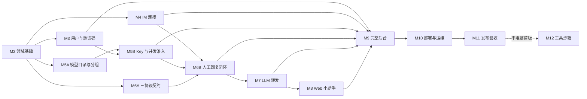

# Human LLM Gateway 实施路线�?
本文件是项目进度的唯一事实来源�?*项目已结项：全部里程碑（M0–M14）均已完成并部署**，后续仅进行维护性修复。阶段只有在代码、测试、文档和推送全部完成后才能标记为“已完成”�?
## 状态说�?
- `[ ]` 未完�?
- `[x]` 已完�?
- 阶段标题使用：未开�?/ 进行�?/ 已完�?/ 阻塞

## 已确认产品规�?
- 系统由部署者初始化，朋友或其他用户使用管理员签发的邀请码注册，管理员也可以直接创建账号�?
- 邀请码支持设置过期时间、撤销和最大使用次数；只有管理员可以签发�?
- 用户创建并绑定自己的 IM 连接，也创建自己�?API Key�?
- API Key 决定请求归属、回复入口和独立回复策略。回复入口可以是用户选择的一�?IM 连接�?Web；任务始终在 Web 可见�?
- Fake Model 是对外身份，与用户配置的真实 LLM 模型无关。管理员维护全局系统模型，普通用户可以创建仅自己可见的私有模型�?
- API Key 可直接选择对外显示和允许调用的 Fake Model；不选择代表允许候选集中的全部模型。模型分组先预筛候选集，Key 的直接选择再进一步收窄�?
- `/v1/models` �?API Key 返回可用 Fake Model；不存在或停用的模型按真实平台行为返�?`model_not_found`�?
- `/v1/models` 必须先通过 API Key 鉴权，不提供匿名模型目录�?
- 每个用户最多同时存�?10 个活动任务，不能通过增加 API Key 或切换真�?LLM 模式绕过；超限直接返回协议兼容的 429�?
- 人工回复先提交完整结果，再伪流式输出。思考内容和 tool call 可以伪造，系统不执行也不等待调用方声明的工具�?
- IM DSL �?Web 编辑器共享同一�?ReplyDraft 结构；提交前可预览编辑，首个有效提交成功后不可撤销或覆盖�?
- 支持 OpenAI Chat Completions、OpenAI Responses、Anthropic Messages 三种外部请求格式�?
- 用户维护自己�?LLM 配置，Web 小助手和 API Key 转发策略都可以选择其中一个配置�?
- 手动调用真实 LLM 时，结果先保存为草稿，用户预览编辑后才进�?Fake 回复流程�?
- �?LLM 和人工超�?fallback 策略可自动返回真�?LLM 结果�?
- 同协议转发保留全部原始字段，追加根据 Fake Model 生成的身�?system 指令；响应中的模型标识改写为 Fake Model�?
- `previous_response_id` 由网关在同一 API Key 范围内校验历史响应并等价展开；原始引用完整落库，不把网关 ID 机械发送给上游�?
- 跨协议无法等价转换的专有参数明确返回协议兼容�?400，不静默丢弃�?
- 上游返回�?tool call 可以转发给外部调用方，但本系统不执行�?
- Web 小助手会话持久化，用户可以删除；页面上下文必须过滤密码、Key、Token �?Secret�?
- 管理员不能替用户回复，不能查看用户的密码、完�?API Key、LLM Secret、IM Token 或登录二维码�?
- 管理员禁用用户时立即撤销会话�?API Key、终止活动任务并释放名额；新请求返回 401，已准入请求只收到通用错误�?
- 当前部署使用统一的数据库 Schema、接口契约和运行链路�?
## 阶段依赖与可并行工作

路线图编号表示产品交付顺序，不代表所有开发任务严格串行。只�?`master` 分支，任何可并行项都必须避免同时修改同一文件，并在完整质量门禁后按里程碑提交�?

- M3、M4、M5A �?M6A 均已完成并纳入当前部署�?
- M5A 不依�?IM；M5B 选择 IM 时复�?M4 能力，但 Web 入口和并发准入可先完成�?
- M6A 只依�?M2 的统一请求/回复结构；M6B 才依�?M4 投递和 M5 准入�?
- M12 已完成，不影响当前部署运行�?
***

## M0-M2：基础能力（已完成�?
- [x] 产品、架构、API、数据库�?UI 规范已建立�?
- [x] 当前领域模型、数据库 Schema、Repository、Service、API 和前端已统一�?
- [x] 用户、权限、加密、任务、Fake Model、LLM 配置、IM 连接和审计基础能力已完成�?
- [x] 当前部署使用单一数据�?Schema 和单一运行链路�?
***

## M3：用户、邀请码和权限闭环（已完成）

- [x] 管理员创建、查看、撤销邀请码，并设置过期时间和最大使用次数�?
- [x] 邀请码撤销后立即不可用但继续显示；只有已撤销邀请码可物理删除，注册来源信息保留在审计日志�?
- [x] 邀请码消费次数原子递增，并发注册不能突破使用上限�?
- [x] 用户使用邀请码注册和登录�?
- [x] 管理员直接创建、启用、禁用普通用户并重置密码�?
- [x] 禁用用户原子撤销会话�?API Key、终止活动任务、释放名额，并让外部等待者只收到通用错误�?
- [x] 用户修改自己的显示名和密码；`must_change_password=true` 登录后处于受限会话，改密成功后恢复完整权限�?
- [x] 普通用户只能访问自己的 IM、LLM 配置、API Key、任务和小助手会话�?
- [x] 管理员不能取得用�?Secret，也不能替用户回复�?
- [x] 后台不提供管理员提升接口；后续管理员通过受控 CLI 创建，最后一个有效管理员不能被禁用�?
- [x] 审计 action 使用稳定枚举，只展示操作者、动作、资源、时间、结果和字段名，不保存字段值或请求正文�?
- [x] 权限、邀请码并发、强制改密和受限会话测试通过�?
完成提交：`feat: 完成 M3 用户与邀请码权限闭环`�?
***

## M4：IM 连接与任务投递闭环（已完成）

- [x] 支持微信 iLink、企�?SDK WebSocket、自定义 Webhook、自定义 WebSocket、自定义 HTTP 轮询�?
- [x] 用户创建、编辑、启动、停止、绑定和删除自己的连接�?
- [x] 管理员查看、检查、启动、停止和删除所有用户连接，但不能创建或绑定连接�?
- [x] 连接配置整体加密，修�?Secret 时空值保留原值�?
- [x] 配置应用和故障恢复只影响目标连接�?
- [x] 期望运行的长连接遇到普通网络错误时带抖动指数退避重连；`auth_required` 停止重试并等待所有者登录�?
- [x] 一个连接可被多�?API Key 选择�?
- [x] API Key 选择 Web 或一�?IM 连接作为投递入口�?
- [x] IM 投递失败不影响 Web 任务可见性�?
- [x] IM �?Web 首个成功回复生效，晚到回复只记录审计并提示任务结束�?
- [x] 进站消息按连接和外部消息 ID 全局幂等�?
- [x] 微信扫码确认后服务端原子保存参数并绑定；企微收到私聊命令 `connect mycom` 后绑定；未绑定连接不能启用�?
- [x] 连接页按平台配置操作按钮；手动检查与 60 秒看门狗复用同一检测逻辑，异常连接自动关闭启用开关�?
- [x] 每个用户在每个平台最多一条连接；微信 iLink 由扫码入口直接创建并绑定，不填写连接信息�?
实现说明：监督循环与状态持久化�?`app/connectors/manager.py` 承担，平台能力通过
`app/connectors/registry.py` 注册；Webhook/WebSocket/HTTP 轮询三个通用连接器可端到�?测试，微�?iLink 与企�?SDK 适配器按�?SDK 契约接入，并把认证失败映射为 `auth_required`�?回复 DSL 的完整渲染在 M6-B 落地，M4 已完成首个提交获胜与晚到审计�?
***

## M5：API Key、Fake Model 与并发控制（已完成）

### M5-A：Fake Model、模型分组与目录

- [x] 管理员维护全局系统 Fake Model，普通用户维护仅自己可见的私�?Fake Model�?
- [x] 用户从自己可见的 Fake Model 创建、编辑、删除和启停可复用模型分组，管理员可治理全部分组�?
- [x] 模型分组作为第一层候选集筛选，不能引用其他用户私有模型�?
- [x] API Key 可从分组预筛后的候选集中继续选择对外模型；未选择代表允许全部候选模型�?
- [x] `/v1/models` 必须鉴权，并返回按可见范围、模型分组和 Key 选择计算出的有效集合�?
- [x] 不存在、停用或不在有效集合�?Fake Model 返回对应协议�?`model_not_found`�?
- [x] `/v1/models` 与三个推理入口复用同一�?effective-model 查询和权限测试�?
- [x] 模型广场桌面端外层不滚动，筛选与模型容器独立滚动，默认每�?12 条�?
### M5-B：API Key、策略与用户级准�?
- [x] 用户创建、查看、禁用和删除自己�?API Key，明文只展示一次�?
- [x] API Key 独立配置 `human`、`llm`、`human_fallback_llm` 策略�?
- [x] API Key 选择 Web 或自己的一�?IM 连接；IM 能力未就绪时 Web 入口仍可独立工作�?
- [x] 人工超时支持 10 秒至 30 分钟，默�?300 秒�?
- [x] 停用或删�?Key 立即阻止新请求，已准入任务使用创建快照继续完成�?
- [x] 每个用户固定最�?10 个活动任务，所�?Key 和策略共用�?
- [x] �?11 个并发请求原子拒绝并返回协议兼容�?429�?
- [x] 完成、失败、超时、取消和禁用用户正确且只释放一次名额�?
- [x] �?Key、多策略并发测试证明无法绕过用户上限�?
实现说明：有效集合由 `app/services/effective_models.py` 单点计算（可�?�?分组 �?Key 选择，只收窄不扩张）；名额由 `app/services/admission.py` 基于
`users.active_task_count` 的条件更新原子占用，三个推理端点复用同一服务�?
***

## M6：人�?Fake LLM 闭环（M6-A �?M6-B 已完成）

### M6-A：统一结构与三协议契约

- [x] 完整接收 OpenAI Chat Completions 请求�?
- [x] 完整接收 OpenAI Responses 请求�?
- [x] 完整接收 Anthropic Messages 请求�?
- [x] 原始请求完整落库，规范化请求不覆盖原始字段�?
- [x] 建立 IM DSL、Web 编辑器、LLM 草稿和协议渲染器共享�?ReplyDraft JSON Schema�?
- [x] `previous_response_id` 只能引用同一 API Key 的完成响应，并由网关等价展开历史上下文；展开遵守链深 20、条�?512、字�?2 MiB 三重上限，超限整请求 400 不截断；展开唯一语义防止历史重复拼接�?
- [x] 完成三协议非流式 JSON、流式事件顺序、reasoning、tool call、结束原因和错误契约测试�?
- [x] SSE 中断语义：Responses �?`response.failed`、Anthropic �?`event: error`、Chat 经锁定版�?OpenAI SDK 契约测试后确定具体中断帧格式或直接断流；中断路径不得伪造正常完成，Chat 中断不得发�?`[DONE]`（正常完成的 Chat 流仍按协议发�?`[DONE]`）�?
- [x] 使用项目锁定�?`openai` Python SDK 实际调用 Chat Completions 流，验证正常完成、中�?error frame、无 error 断流和客户端主动取消；SDK 升级时重新运行该契约测试�?
- [x] Responses `background`、`conversation`、`store=true` 按字段矩阵返回 400 `unsupported_parameter`；`store=false` 兼容无状态客户端并与网关内部任务留存解耦；`service_tier` 同协议透传。
- [x] 外部调用方断开规则：任务终态前断开原子进入 CANCELLED（`caller_disconnected`）并幂等释放名额；COMPLETED 与断开竞争时首个合法条件转换获胜，晚到回复只记录审计�?
- [x] 请求体大小上限：`/v1/*` 推理请求 8 MiB、管�?API 1 MiB，超限在完整 JSON 解析和任务创建之前返回协议兼�?413；chunked 传输按读取累计字节执行同一上限�?
### M6-B：任务工作台与人工提�?
- [x] Web 任务详情展示完整原始请求、Fake Model、工具和时间线�?
- [x] 回复编辑器支持思考内容、最终文本、多个假 tool call �?JSON 校验�?
- [x] 支持保存和恢复回复草稿�?
- [x] IM DSL 解析结果�?Web 编辑器加载同一�?ReplyDraft，结果往返不丢字段�?
- [x] 提交前提供预览和确认；首个有效提交后不可撤销、回退或覆盖�?
- [x] 人工提交完整回复后才开始伪流式输出�?
- [x] 系统不执行、不等待�?tool call�?
- [x] 人工超时和内部异常返回不泄露人工/IM/fallback 的通用协议错误�?
- [x] Web �?IM 回复结果一致，晚到回复不能覆盖�?
M6 完成后达到首个可�?MVP�?
***

## M7：LLM 配置、草稿和自动转发（M7-A、M7-B、M7-C �?M7-D 已完成）

### M7-A：用户级 LLM 配置管理

- [x] 用户维护 OpenAI-compatible �?Anthropic LLM 配置�?
- [x] 配置包含名称、协议、Base URL、API Key、真实模型和超时；不开放自定义请求头�?
- [x] 支持连通性测试且不回�?Secret；三种协议发起真实生成请求（要求上游返回非空响应，OpenAI 协议不再�?GET /models），硬上�?10 秒�?
- [x] 保存启用态配置需先通过连通性测试（测试失败返回 400 不落库）；仅修改高级参数不触发测试�?
- [x] 被有�?API Key 或活动任务引用的配置删除返回 409；历史任务保存非敏感配置快照�?
- [x] 管理 API `/api/llm-configs` CRUD + `POST /test`；前�?LLM 管理页（列表 + 编辑 + 测试）�?
### M7-B：手动调�?LLM 生成草稿（已完成�?
- [x] 用户选择 LLM 配置在任务详情页调用上游生成持久化草稿（`POST /api/tasks/{id}/drafts/generate`）�?
- [x] 仅同协议生成（Chat/Responses -> openai\_compatible；Anthropic -> anthropic），跨协议在 M7-C 字段矩阵后开放�?
- [x] 草稿支持 LLM 来源标记（source=llm + source\_llm\_config\_id）并由用户预览编辑后手动提交，不自动完成任务�?
- [x] 上游响应解析为统一 ReplyDraft（reasoning / tool\_calls / final\_text），失败返回 502/504 不泄�?Secret�?
- [x] 前端任务详情抽屉提供"生成草稿"入口：选择 LLM 配置 -> 生成 -> 进入编辑器�?
### M7-C：自动转发核心（已完成）

- [x] `llm` 策略直接转发真实 LLM：任务创建后不经人工等待，转发结果进 RESPONSE\_READY，由既有伪流式路径输出�?
- [x] `human_fallback_llm` 在人工超时后只转发一次：等待循环内联触发，claim\_fallback 原子声明（人工先到则声明失败、上游从未被调用）；转发失败不重试�?
- [x] 转发请求追加基于 Fake Model description 派生的身�?system 指令（无 description 时通用兜底），追加在调用方已有 system 内容之后�?
- [x] 仅同协议转发（Chat/Responses -> openai\_compatible；Anthropic -> anthropic）；跨协议按矩阵返回 400 `unsupported_parameter`（对外通用 500，不暴露细节）�?
- [x] 上游非流式响应解析为统一 ReplyDraft 后走既有渲染器；响应与流事件 model 改写�?Fake Model（M6 已有）�?
- [x] 上游 tool call 只写�?ReplyDraft 转发，不执行、不等待�?
- [x] API Key 前端放开 `llm` / `human_fallback_llm` 策略选择�?LLM 配置绑定�?
- [x] 上游 HTTP 调用抽到 `app/services/llm_upstream.py`（草稿生成与转发共用，超�?504 / 网络 502 / �?2xx 502，不透传上游正文）�?
### M7-D：完整跨协议字段矩阵与上游流式（已完成）

- [x] `app/protocols/cross.py`：�?2.6 矩阵逐项实现——系统指�?内容块（�?developer role、Anthropic blocks）、输出上限（max\_tokens <-> max\_completion\_tokens / max\_output\_tokens）、采样参数、停止序列（字符�?<-> 数组 <-> stop\_sequences）、函数工�?Schema（function.parameters <-> input\_schema）、工具选择（required <-> any；指定函�?<-> tool{name}）、并行工具（parallel\_tool\_calls <-> disable\_parallel\_tool\_use 取反）、工具调�?结果（tool\_calls/tool role <-> tool\_use/tool\_result）、metadata（user <-> metadata.user\_id）�?
- [x] `cache_control` 等供应商专有字段：同协议原样保留；跨协议（含内容块内嵌）无等价项返回 400 `unsupported_parameter`�?
- [x] 未知跨协议字段返�?`unsupported_parameter`（严格白名单 + 显式拒绝列表：reasoning 控制、结构化输出�?Anthropic、service\_tier、托管工具），不静默忽略或塞�?metadata�?
- [x] 上游真实流转发：`stream_chat_completions` / `stream_anthropic_messages` �?SSE 接收增量（Chat delta / Anthropic content\_block 事件），归一�?UpstreamChunk 增量聚合为完�?ReplyDraft 后按既有原子裁决落库，再伪流式输出（完整结果先持久化语义保持）�?
- [x] 跨协议生成（M7-B 草稿）同步开放：Chat/Responses 任务可�?Anthropic LLM 配置，反之亦然�?
- [x] 流式转发�?llm 策略 stream=true 请求时自动启用（human\_fallback\_llm 与非流式仍走非流式路径）�?
***

## M8：全局 Web 小助手（M8-A �?M8-B 已完成）

### M8-A：助手后端（已完成）

- [x] 会话/消息 API（GET/POST `/api/assistant/sessions`、详�?删除、`POST /sessions/{id}/messages`），owner 严格隔离�?
- [x] 页面上下文双层脱敏（`app/services/assistant/redaction.py`）：封闭 schema（StrictModel 未知字段拒收 + feature/resource 键白名单）为主防线；自由文本（resource 值、unsaved\_edit、tool\_call arguments 值、用户消息文本）凭据形态正则擦洗为兜底，落库与送上游均为干净版�?
- [x] LLM 调用复用用户 llm\_configs（OpenAI/Anthropic 双协议），历史轮次携带（最�?40 条），upstream 元数据脱敏落库�?
- [x] 第一阶段只生成文本，无系统工具�?
### M8-B：助手前端（已完成）

- [x] 全局悬浮�?+ 右侧面板（AssistantProvider 挂载�?AuthedShell，切换路由保持状态）；管理员不展示（无个人业务场景）�?
- [x] 会话管理 UI：下拉切�?/ 选定 LLM 配置新建 / 删除（确认）�?
- [x] PageContextRegistry 前端注册表（`contextRegistry.ts`）：10 �?feature 路由映射与白名单 resource 提取（查询串只取声明键，secret 形态字段结构上不进入快照）；切换路由自动替换待发送上下文，不累积；发送前面板显示当前上下文摘要与「含未提交草稿」标记�?
- [x] 编辑器桥（`bridge.ts`）：ReplyEditor 挂载时上报未提交草稿（reasoning/final\_text/tool\_calls，ref 防闭包过期）与任务资源字段，卸载注销�?
- [x] 「插入到回复编辑器」：覆盖 + 用户确认弹窗（预览全�?+ 红字警示不可撤销）�?
- [x] 发送走 M8-A 后端（封�?schema + 双层脱敏）；Enter 发�?/ Shift+Enter 换行 / Esc 收起�?
M8 完成定义达成：后端双层脱�?+ 前端白名单采�?+ 会话/消息闭环 + 插入编辑器（覆盖确认）�?
***

## M9：管理后台、日志和完整体验（已完成�?
M9 定义为体验收口期，不重新实现 M3-M8 已交付的业务领域逻辑。它对已有页面按 `UI_GUIDE` 做完整体验、导航、筛选、分页、响应式、权限和一致性复核，并实现此前阶段未要求的新页面�?
- [x] 导航顺序固定为：控制台、任务工作台、连�?IM、API 管理、模型目录、LLM 管理、系统设置（日志审计、邀请码、用户、账号）；`logs.manage` 能力仅管理员可见�?
- [x] 系统设置分组包含日志审计、邀请码管理、用户管理和账号设置�?
- [x] 默认进入控制台（既有行为保持）�?
- [x] 使用 Tailwind CSS 4 实现浅色 RuoYi 风格后台，不引入 Vue/Element（既有，M9 复核保持）�?
- [x] 统一页面标题、操作区、筛选区、紧凑表格、分页、弹窗和抽屉（新页面沿用 PageHeader/Card/Pagination 组件体系）�?
- [x] 控制台实质化：`/api/dashboard` 统一全站统计 + 当前用户最近任务；可用模型按启用系统模型与当前用户私有模型计算，前端缺省显�?`0`�?
- [x] 日志页（LogsPage，`logs.manage`）：审计日志（动�?资源类型/时间窗筛选，只展示操作�?动作/资源/字段�?结果——不泄露字段值）与应用日志（级别/事件/时间�?+ request/task/user 关联展示）双 tab 分页�?
- [x] 管理员页面展示资源所有者，普通用户不显示越权操作（M3-M8 已交付，M9 复核保持：列�?owner\_username 仅管理员视图、日志页仅管理员路由）�?
- [x] 日志支持按时间、级别、用户、任务、Key 和连接筛选（`/api/app-logs` 全参数已实现，前端提供级�?事件/时间窗入口）�?
- [x] 刷新、前进和后退保持当前页面（React Router 路由表既有，M9 复核保持）�?
- [ ] 验证 1440px�?024px�?90px 布局和键盘操作（表格 min-w + overflow-x-auto 已按既有模式覆盖；三档实测由 M11 用户验收统一执行）�?
***

## M10：部署与运维交付（基础部署已完成）

- [x] 完成单端口生产式部署说明：构�?`admin/dist`，由 `app.api:app` 托管管理台和 API，并通过 `/healthz` 检查存活�?
- [ ] GitHub Actions �?`master` push 和手动触发时执行后端与前端完整质量门禁�?
- [x] `/healthz` 只检查进程存活；`/readyz` 检�?5 项就绪条件（startup、DB+Schema+启动写入、加�?sentinel、协�?registry、协调器+connector registry），未就绪返�?503�?
- [x] 单个 IM 连接故障不使整个实例未就绪，连接健康继续独立展示�?
- [ ] 提供 SQLite 在线备份、保留期、恢复命令和至少一次恢复演练，不在 WAL 写入时直接复制单文件�?
- [ ] 加密主密钥备份两级实践：首�?Vault/KMS/�?Secret Manager 与数据库分系统存放；小型自托管使�?age/SOPS 加密文件，恢复私钥存放于密码管理器或离线介质；数据库备份不包含明文主密钥�?
- [ ] 利用 `encryption_key_version` 字段实现 key ring 与主密钥轮换流程；未�?key\_version 解密失败按配置错误处理�?
- [ ] 应用日志输出、数据库日志保留、Docker/systemd 日志轮转和磁盘上限有明确配置�?
- [ ] `/metrics` 使用 Prometheus exposition format，只暴露低基数指标，标签只允许有限枚举，禁止 user\_id/api\_key\_id/task\_id/connection\_id/model/base\_url/error\_message�?
- [ ] 验证优雅关闭：停止准入、结束或取消活动任务、停止连接器并确保名额不泄漏�?
- [ ] 完成发布前安全配置清单和故障排查手册�?
***

## M11：发布验收（进行中）

- [ ] `uv lock --check` 通过�?
- [ ] Ruff format �?lint 通过�?
- [ ] 后端单元、集成、权限、并发和三协议契约测试通过�?
- [ ] 前端 `npm ci` 和生产构建通过�?
- [ ] 新数据库启动、管理员登录和默认目录种子冒烟通过；初始化环境变量密码不满足策略时启动失败�?
- [ ] 管理�?CLI 创建、最后管理员保护、禁用用户终止任务冒烟通过�?
- [ ] 强制改密和受限会话交互测试通过�?
- [ ] IM/Web 人工回复、伪流式、LLM 草稿、自动转发完整冒烟通过�?
- [ ] `/v1/models` 鉴权、模型分组、Key 模型选择和多 Key 10 任务上限完整冒烟通过�?
- [ ] `previous_response_id` 历史链（三重上限）、跨协议字段矩阵�?SSE 中断语义契约测试通过�?
- [ ] 锁定版本 OpenAI SDK Chat Completions 流中断行为契约测试通过并锁�?SDK 版本�?
- [ ] 外部调用方断开取消（caller\_disconnected 竞争与名额释放）和请求体大小上限�? MiB / 1 MiB �?413）契约测试通过�?
- [ ] 推理错误状态映射（429/504/500/413）与错误伪装安全检查通过�?
- [ ] 敏感信息、越权访问和错误伪装安全检查通过�?
- [ ] 在线备份恢复、`/healthz`、`/readyz`（含加密 sentinel）、`/metrics` 和优雅关闭演练通过�?
- [ ] 1440px�?024px�?90px 由用户完成实际页面验收�?
- [ ] README、部署说明和路线图状态同步；LICENSE 包含 AGPL-3.0�?
- [ ] `master` 已推送且远端提交可验证�?
***

## M12：隔离工具沙箱（已完成）

只有出现明确的真实工具执行需求后才启动本阶段；在此之前，调用方和上游声明�?tool call 始终只作为数据转发�?
- [x] 管理员维护工具白名单：`/api/tools` CRUD（名称唯一、命令模板占位符与参�?Schema 一致性校验、shell 元字符拒绝、仅 string 属性、超�?1-120s）�?
- [x] 用户只能执行白名单内已启用工具：目录视图不含命令模板�?Schema（管理员可见）；停用/删除即拒�?
- [x] 工具�?Docker/Podman Linux OCI 容器运行，Windows、macOS、Linux 共用同一契约；无网络、无宿主挂载、只读根文件系统、非 root、capability 清零、no-new-privileges，并限制 CPU、内存、PID、文件描述符、时间和单边 64 KiB 输出。运行时不可用时失败关闭，不回退宿主执行�?
- [x] 调用方声明的工具永远不会自动获得执行权限：协议层 tool\_calls 数据转发与沙箱路径完全隔离（专项测试固化——上游返�?rm 工具调用仅转发，ToolExecution 零记录）�?
- [x] 工具执行需要当前用户权限和显式确认，并写入完整审计：`confirmed=false` 拒绝并审计（not\_confirmed）；执行结果（成�?失败/超时/超限）与拒绝原因（disabled/not\_found/invalid\_arguments/not\_confirmed）全部进审计�?
- [x] 前端工具沙箱页（/tools）：管理�?CRUD 表单（模�?Schema JSON/超时）；所有用户执行弹窗（参数输入 + 结果 stdout/stderr 展示）；执行历史分页（管理员看全部、用户看自己）�?
- [x] 全新数据库默认提�?`Print` 工具，用�?Fake Tool Call，并可在沙箱控制台输�?`text` 参数�?
- [x] 沙箱支持 stdin 传参（`stdin_parameter`，`docker run -i`�?4 KiB 上限、不�?argv/shell）；内置工具扩展�?Print、ToUpper、ToLower、Base64Encode、Sha256、SystemInfo（SCHEMA\_VERSION 9）�?
- [x] 沙箱逃逸面、资源耗尽、网络越权、命令注入和 Secret 泄漏安全测试通过；完整运维与自定义镜像说明见 `docs/SANDBOX.md`�?
***

## M13：traceId 日志体系、IM 连接收口与数据保留（已完成）

体验与契约收口期：不引入会话实体（对�?new-api：每请求独立，网关不做会话聚合），previous\_response\_id 链行为保持既有契约�?
- [x] 服务端统一生成内部 trace\_id（即 request\_id，全链路单一 ID）�?
- [x] /api/\* JSON 成功/失败响应顶层追加 	race\_id 并回�?X-Trace-Id�?v1/\* 只加头不改协议正文�?
- [x] 日志落库改为异步批量队列（专用线�?+ 批量 INSERT），事件循环内调用不再阻�?SQLite 写锁�?
- [x] 普�?logging 告警/异常（看门狗、连接器、IM 后台任务、sweeper）经 root handler 落入 app\_logs，不再只有显�?log\_event() 可查�?
- [x] app\_logs 增加 logger 列与 request\_id/event 索引�?api/app-logs?with\_context=true 返回脱敏上下文与异常详情，前端日志页点击消息查看详情�?
- [x] 删除连接时阻止任�?API Key 引用（含停用 Key），提示引用数量�?Key 前缀�?
- [x] 网关自签 IM Token 统一由服务端生成 `hllm-` 前缀，创�?轮换时仅一次性展示；全部平台使用统一弹窗，同屏展示配置、完�?URL �?curl 接入指引�?
- [x] 关闭扫码/绑定弹窗不删除连接与凭据；新�?inding/cancel（取消本次绑定监听）�?
- [x] 启用前校验连接状态：未绑定或 uth\_required/error 拒绝启用；看门狗关闭异常连接时记�?trace 日志�?
- [x] Chat Completions：usage 统一本地估算、stream\_options.include\_usage、流式稳�?id/created�?
- [x] Responses：补�?usage、消�?ID、annotations、sequence\_number、content part �?arguments delta/done 事件；官�?SDK 契约测试固化�?
- [x] Anthropic：修正事件顺序与 usage；人工路径不返回 thinking block（无法伪�?signature）�?
- [x] 统一确定�?token 估算器（pp/domain/tokens.py）：三协议共用同一份快照，流式与非流式数值一致�?
- [x] 任务详情页：所有者完整提示词无截断；原始请求 JSON 按需加载（独立端�?+ 懒加载）�?
- [x] 高频数据保留：后台每七天清理七天前的应用/审计日志、助手会话、过期登录态、任务事件、工具执行与 IM 运行记录；请求任务和正式草稿保留�?
- [x] 修复 RequestIdMiddleware trace\_id 注入�?content-length 过期、生产环�?`/api/*` JSON 响应被截断的缺陷（ASGI body 消息不带 headers，改为缓�?start+body 后重�?content-length）�?
- [x] 生产部署上线�?https://newapi.rjgjx.top（部署相关问题优先以线上表现为准核对）�?

- [ ] M11 用户验收�?440/1024/390 布局实测与浏览器冒烟�?
***

## M14：统一回复工作台（已完成）

- [x] 删除旧独立回复页�?`/tasks/:id/reply` 路由，任务详情统一进入 `/replies` 工作台�?
- [x] 新增工作台收件箱、待回复数量、未读状态、已读接口和最后事件游标�?
- [x] 新增对话投影接口和单条完整消息按需加载，保留原始请求，不在展示层修改推理输入�?
- [x] 草稿更新强制携带 `expected_version`，版本冲突返�?`409 draft_version_conflict`�?
- [x] 前端完成工作台、分页、连接只读监管、日志七日提示和相关类型/API 同步�?
- [x] 增加 M14 API、权限隔离、乐观锁和对话投影测试�?
### M14-B：工作台增强（已完成�?
- [x] 移除 DSL 双向同步：编辑器（思考链/正式回复/工具调用 Tab）为唯一入口，提交前仅展示结构化预览�?
- [x] 生成草稿支持三种模式（只生成思考链 / 只生成回�?/ 两者都生成）；reply 模式可携带人工手写的 `reasoning_seed` 作为生成依据，同任务的后续按模式合并更新同一草稿�?
- [x] 生成草稿支持消息级上下文勾选：对话投影携带 `context_index`，请求时�?`exclude_context_indices` 精确剔除历史，越界返�?400�?
- [x] 无沙箱环境禁止伪�?tool\_call：Web 草稿保存/更新/提交�?IM 回复入口统一拒绝 400（sandbox\_unavailable），由沙箱不可用状态自动触发；沙箱恢复后再次开放�?